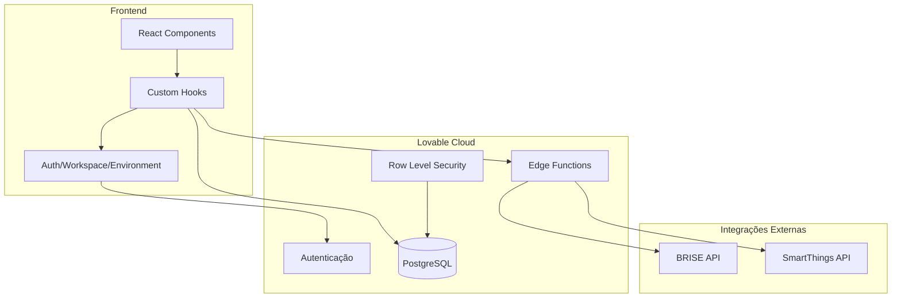
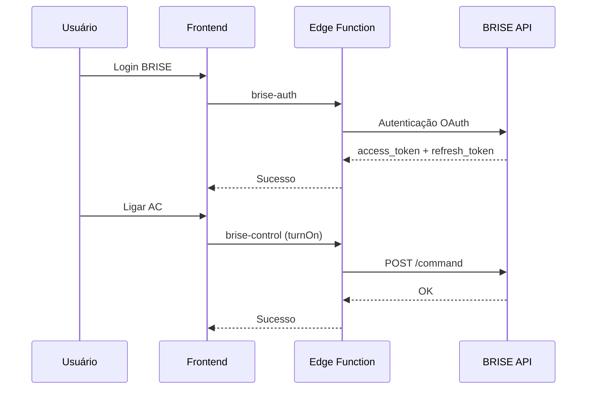

# Arquitetura do Sistema

## Visão Geral

Sistema de gerenciamento de ambientes inteligentes com controle de ar-condicionado, monitoramento de consumo energético e automações baseadas em horário e ocupação.

### Stack Tecnológico

- **Frontend**: React 18 + TypeScript + Vite
- **Estilização**: Tailwind CSS + shadcn/ui
- **Estado**: TanStack Query (React Query)
- **Backend**: Lovable Cloud (Supabase)
- **Integrações**: BRISE, SmartThings

### Diagrama de Arquitetura



---

## Estrutura de Pastas

```
src/
├── components/
│   ├── automations/      # Componentes de automação (6 arquivos)
│   ├── dashboard/        # Cards e dialogs do dashboard (7 arquivos)
│   ├── equipments/       # Gerenciamento de equipamentos (3 arquivos)
│   ├── layout/           # Layout, navegação, rotas protegidas (3 arquivos)
│   ├── reports/          # Gráficos e exportação (5 arquivos)
│   ├── settings/         # Configurações (4 arquivos)
│   ├── ui/               # Componentes base shadcn/ui (50 arquivos)
│   ├── users/            # Gerenciamento de usuários (1 arquivo)
│   └── workspace/        # Multi-tenancy workspace (7 arquivos)
│
├── contexts/
│   ├── AuthContext.tsx       # Autenticação do usuário
│   ├── WorkspaceContext.tsx  # Workspace atual selecionado
│   └── EnvironmentContext.tsx # Estado dos ambientes
│
├── hooks/                # 20 hooks customizados
├── pages/                # 10 páginas da aplicação
├── lib/                  # Utilitários (i18n, utils, exportação)
├── locales/              # Traduções (4 idiomas)
└── integrations/         # Cliente Supabase (auto-gerado)

supabase/
└── functions/            # 10 Edge Functions
```

---

## Banco de Dados (21 Tabelas)

### Domínio: Core (Multi-tenancy)

| Tabela | Propósito | Relações |
|--------|-----------|----------|
| `workspaces` | Espaços de trabalho isolados | owner_id → auth.users |
| `workspace_members` | Membros de cada workspace | workspace_id, user_id |
| `workspace_invitations` | Convites pendentes | workspace_id, invited_by |
| `workspace_settings` | Configurações (tarifa kWh) | workspace_id |
| `profiles` | Dados públicos dos usuários | id = auth.users.id |
| `user_roles` | Roles globais (admin/manager/viewer) | user_id |

### Domínio: Equipamentos e Ambientes

| Tabela | Propósito | Colunas Principais |
|--------|-----------|-------------------|
| `equipments` | Ar-condicionados cadastrados | name, location, model, capacity, nominal_power, is_on, current_temp, target_temp, mode, integration, brise_device_id, smartthings_device_id |
| `environments` | Agrupamento de equipamentos | name, equipment_ids[], is_active, is_automatic, cooling/heating configs |

### Domínio: Integrações

| Tabela | Propósito | Campos Sensíveis |
|--------|-----------|------------------|
| `brise_config` | Credenciais BRISE | access_token, refresh_token, token_expires_at |
| `smartthings_config` | Token SmartThings | personal_access_token, location_id |

### Domínio: Automações

| Tabela | Propósito |
|--------|-----------|
| `time_routines` | Rotinas baseadas em horário |
| `time_routine_schedules` | Dias/horários de cada rotina |
| `time_routine_exceptions` | Feriados e exceções |
| `time_routine_environments` | Ambientes vinculados às rotinas |
| `occupancy_automations` | Automações por ocupação |
| `occupancy_automation_environments` | Ambientes vinculados |
| `occupancy_events` | Histórico de eventos |

### Domínio: Monitoramento

| Tabela | Propósito | Frequência |
|--------|-----------|------------|
| `energy_history` | Histórico de consumo (kWh) | A cada 30min |
| `temperature_history` | Histórico de temperatura | A cada 30min |
| `alerts` | Alertas gerados | Sob demanda |
| `alert_settings` | Configuração de alertas | Por workspace |

---

## Integrações Externas

### BRISE (Ar-condicionado)



**Edge Functions:**
- `brise-auth`: Autenticação OAuth com BRISE
- `brise-devices`: Lista dispositivos vinculados
- `brise-status`: Sincroniza estado dos dispositivos
- `brise-control`: Envia comandos (ligar/desligar/temperatura)

**Hooks:**
- `useBriseConfig`: Gerencia configuração
- `useBriseDevices`: Lista dispositivos
- `useBriseControl`: Envia comandos
- `useBriseSync`: Sincronização periódica (30s)

### SmartThings

**Edge Functions:**
- `smartthings-auth`: Valida token de acesso
- `smartthings-devices`: Lista dispositivos
- `smartthings-sync`: Sincroniza estado
- `smartthings-control`: Envia comandos

**Hooks:**
- `useSmartThingsConfig`: Gerencia configuração
- `useSmartThingsDevices`: Lista dispositivos
- `useSmartThingsControl`: Envia comandos

---

## Sistema de Automações

### Rotinas por Horário (Time Routines)

Permite definir horários de funcionamento para cada ambiente:

```
Rotina: "Horário Comercial"
├── Segunda a Sexta: 08:00 - 18:00
├── Sábado: 09:00 - 13:00
└── Exceções:
    ├── 25/12: Fechado (Natal)
    └── 01/01: Fechado (Ano Novo)
```

### Automações por Ocupação

Detecta inatividade e desliga equipamentos automaticamente:

- **Timeout**: Tempo de inatividade (padrão: 15 min)
- **Reativação**: Liga novamente ao detectar presença
- **Respeita Rotinas**: Só funciona dentro do horário definido

---

## Segurança (RLS)

Todas as tabelas possuem Row Level Security ativo:

- **Leitura**: Membros do workspace podem visualizar
- **Escrita**: Apenas admins do workspace podem modificar
- **Deleção**: Apenas admins (owner não pode ser removido)

Funções de verificação:
- `is_workspace_member(user_id, workspace_id)`
- `is_workspace_admin(user_id, workspace_id)`
- `has_role(user_id, role)`

---

## Coleta de Dados

Edge function `collect-energy-data` executa a cada 30 minutos:

1. Lista todos os equipamentos
2. Calcula consumo estimado: `(nominal_power * 0.5h) / 1000 kWh`
3. Registra em `energy_history` e `temperature_history`
4. Verifica alertas (temperatura fora do range)
5. Envia e-mail se configurado
